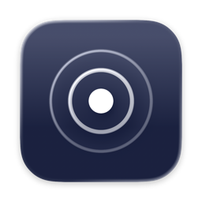
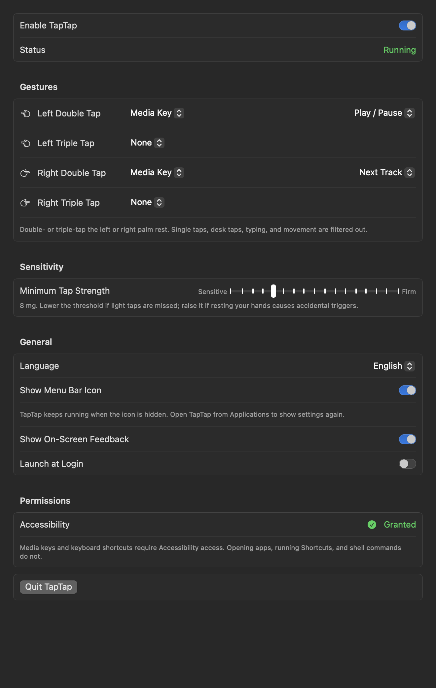

<p align="center"></p>

# TapTap

Turn taps on your MacBook's palm rest into useful actions. TapTap is a native macOS menu bar app that recognizes double and triple taps on the left and right sides of the laptop.

[简体中文](README.zh-CN.md) · [MIT License](LICENSE)



## Features

- Four gestures: left/right double tap and left/right triple tap.
- Assign media keys, keyboard shortcuts, apps, Apple Shortcuts, or shell commands.
- Record a key combination or edit it manually: single keys, Command, Option, Control, Shift, Fn, F1–F20, navigation keys, and the numeric keypad.
- Send a shortcut to the current app or directly to a selected app in the background. A Test button sends it after a three-second countdown.
- Adjust the minimum tap strength from 4 to 20 mg; typing, movement, and desk taps are filtered to reduce accidental triggers.
- Optional on-screen feedback, launch at login, and a hideable menu bar icon.
- English, Simplified Chinese, and Traditional Chinese. Change the language instantly in Settings → General → Language, or follow the system language.

Defaults: **left double tap → Play / Pause**, **right double tap → Next Track**. Triple taps start unassigned.

## Requirements

- macOS 14 or later.
- A MacBook that exposes the `AppleSPUHIDDevice` accelerometer used by TapTap. The app detects unsupported hardware and reports it in settings. Apple Silicon alone does not guarantee compatibility.
- Xcode 26 or later to compile the Icon Composer app icon, with Xcode selected as the active developer directory.

The sensor interface is undocumented. Compatibility and recognition accuracy can vary with the Mac, macOS version, desk, and how the laptop is supported. This is an experimental utility; the bundled classifier is a starting point rather than a guarantee for every machine.

## Build and install

```sh
git clone https://github.com/yu2001-s/TapTap.git
cd TapTap
swift test
Scripts/install-app.sh
```

The installer builds and verifies the app, updates `/Applications/TapTap.app`, and opens settings. It uses a locally available Apple Development certificate and remembers that certificate in the ignored `.signing-identity` file. Keep the same signing identity and bundle identifier across updates to preserve the app's identity for Accessibility authorization.

To choose a certificate explicitly:

```sh
SIGN_IDENTITY='Apple Development: Your Name (TEAMID)' Scripts/install-app.sh
```

To build without a developer certificate, explicitly request an ad-hoc signature:

```sh
SIGN_IDENTITY=- Scripts/build-app.sh
open build/TapTap.app
```

Ad-hoc builds can require granting Accessibility access again after rebuilding. Install in `/Applications` before enabling launch at login. See [BUILDING.md](docs/BUILDING.md) for packaging and distribution details.

## First use

1. Open settings from the menu bar icon.
2. For media keys or keyboard shortcuts, click **Grant Access…**, then enable TapTap in **System Settings → Privacy & Security → Accessibility**.
3. Assign actions and gently double- or triple-tap a palm rest. Lower the threshold if taps are missed; raise it if resting your hands causes accidental triggers.

Opening apps, running Apple Shortcuts, and shell commands do not require Accessibility access. Choose shell commands deliberately: they run as your logged-in user via `zsh -lc`.

When the menu bar icon is hidden, open TapTap from Applications to return to settings. TapTap continues running in the background. The settings window also provides a Quit button.

### Discord mute example

Choose **Keyboard Shortcut → Edit…**, set **⇧⌘M**, and set **Send To → Discord** while Discord is running. This sends Discord's [built-in mute/unmute shortcut](https://support.discord.com/hc/en-us/articles/225878307--macOS-Discord-Hotkeys) directly to its process without bringing its window forward. Some apps' custom global keybind listeners do not respond to simulated global input; app-directed shortcuts offer another route. Use **Test** to check the result before relying on a gesture. Support for background delivery depends on the receiving app.

## Privacy and storage

Gesture detection and classification run locally. TapTap has no analytics or backend. Action mappings and preferences are stored in macOS UserDefaults. No sensor recordings are saved during normal app use.

The app checks elapsed time since the last key or mouse click to suppress accidental taps. The shortcut recorder observes keys while recording inside TapTap; it ignores other apps' input. Configured shell commands, apps, or Apple Shortcuts may perform their own network or file operations.

The optional collection CLI saves sensor measurements and session metadata locally. Raw recordings, local signing choices, certificates, environment files, and build output are excluded from this repository.

## Development

```sh
swift test
swift build --product taptap
swift run taptap live --verbose
```

- `Sources/TapTapApp/`: menu, settings, localization, action execution, and feedback.
- `Sources/TapCore/`: sensor reader, tap detector, classifier, and gesture grouping shared by the app and CLI.
- `model/tapmodel.json`: bundled random forest classifier.
- `Resources/AppIcon.icon/`: editable Icon Composer icon with SVG layers.
- `Tests/`: settings compatibility, shortcut playback, launch behavior, and localization checks.

See [CONTRIBUTING.md](CONTRIBUTING.md) and [model training](docs/TRAINING.md).

## License

[MIT](LICENSE).
